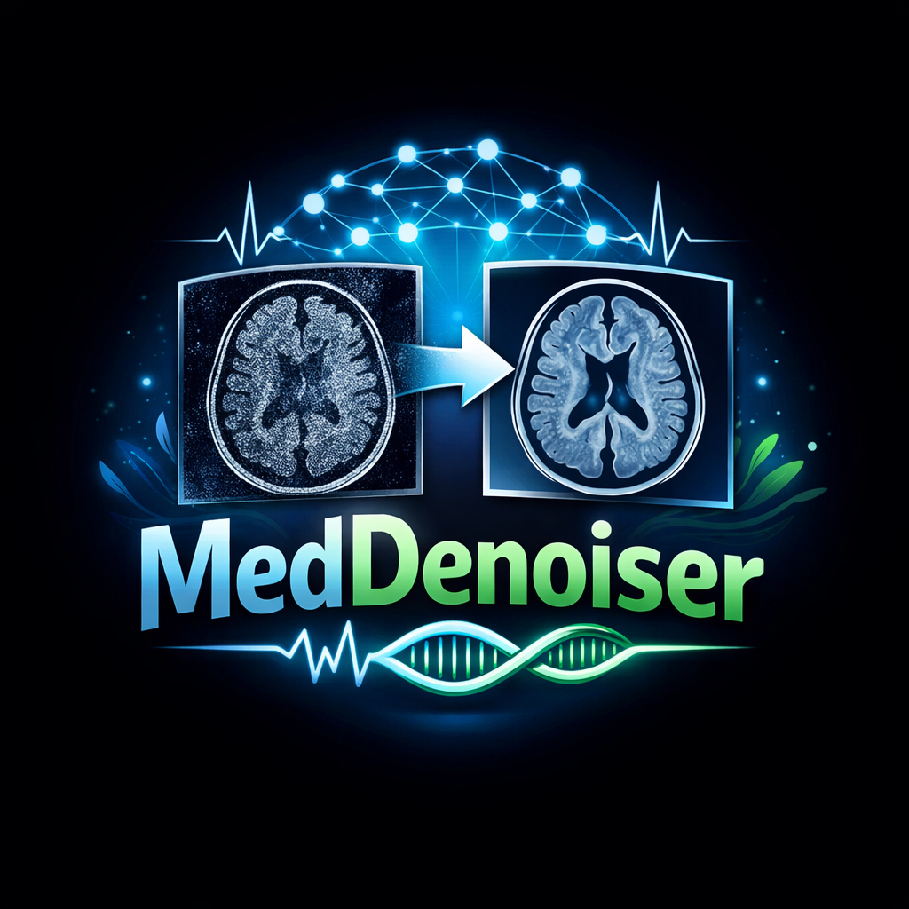
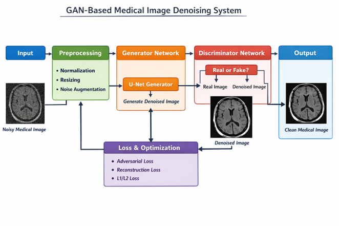


<h1 align="center">MedDenoiser</h1>
<p align="center">  </p>
<p align="center"> 
  Medical Image Denoising using Generative Adversarial Networks </p> <p align="center">   
       </p>

---
## ✪ Project Overview

- MedDenoiser is an GAN based system designed to enhance medical images by removing noise while preserving critical diagnostic details.
- The project leverages Generative Adversarial Networks (GANs) to perform high-quality denoising, ensuring that important features like tumor boundaries, tissues, and lesions remain intact.
- Unlike traditional filtering methods, this system focuses on detail preservation + realism, making it suitable for medical analysis support.
---

## ✪ Problem Statement
Medical images often suffer from:
- Noise due to low radiation exposure
- Hardware and environmental limitations
- Loss of critical details during denoising


Challenges include:
- Traditional filters blur important structures
- Reduced diagnostic reliability
- Difficulty in preserving edges and textures

---
## ✪ Solution

MedGAN Denoiser provides:
- Intelligent noise removal using GANs
- Preservation of fine anatomical details
- Improved image clarity for diagnosis
- Comparison with traditional denoising techniques

---
## ✪ System Architecture
<p align="left">  </p>

---
## ✪ Core Modules
1. Dataset Preparation Module
Medical datasets (MRI / CT / X-ray)
Noise injection:
Gaussian Noise
Speckle Noise
Image normalization and resizing
2. Generator Network
U-Net based CNN architecture
Responsible for generating denoised images
Captures both global and fine-grained features
3. Discriminator Network
CNN-based classifier
Distinguishes:
Real (clean) images
Fake (denoised) images
4. Training Module
Adversarial training (Generator vs Discriminator)
Loss Functions:
Adversarial Loss
L1 / L2 Loss
Perceptual Loss
Optimizer: Adam
5. Evaluation Module
Metrics:
PSNR (Peak Signal-to-Noise Ratio)
SSIM (Structural Similarity Index)
MSE (Mean Squared Error)
6. Comparison Module
Benchmark against:
Gaussian Filter
Median Filter
Non-Local Means
CNN-based models
✪ Tools & Technologies
Languages: Python
Frameworks: PyTorch / TensorFlow
Libraries: OpenCV, NumPy, Matplotlib
Machine Learning: GANs, CNNs
Version Control: Git & GitHub
✪ Project Goals
Design a GAN-based denoising architecture
Train model on medical datasets
Evaluate using PSNR, SSIM, MSE
Compare with traditional methods
Build a complete end-to-end pipeline
✪ Milestones
Dataset collection & preprocessing
Baseline CNN implementation
GAN model development
Training & tuning
Evaluation & comparison
Final demo & documentation

## 📁 Project Structure

```bash
medgan-denoiser/
│── data/
│── models/
│   ├── generator/
│   ├── discriminator/
│── training/
│── evaluation/
│── utils/
│── notebooks/
│── main.py
│── requirements.txt
│── README.md

